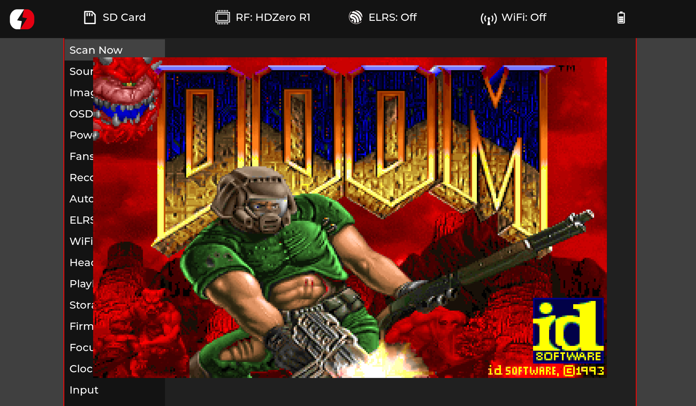

## hdzero-doom is DOOM for [hd-zero goggle](https://github.com/hd-zero/hdzero-goggle)

This DOOM version was forked from [fbdoom](https://github.com/stoffera/fbdoom "fbdoom").

This is not a full-fledged game. This is a proof of concept "DOOM will run on literally anything". You can only watch the demo.

You can try because no need to flash your goggle. It can run code from the sd-card.

## Compiling
```
./setup.sh
cd build
make -j `nproc`
```
Details are [here](https://github.com/hd-zero/hdzero-goggle?tab=readme-ov-file#native-setup)

## Running

copy sdcard/develop.sh into sdcard root
copy out/HDZGOGGLE into sdcard root
copy somewhere/on/the/Internet/doom.wad into sdcard root

# Turn on your goggle and get this:

